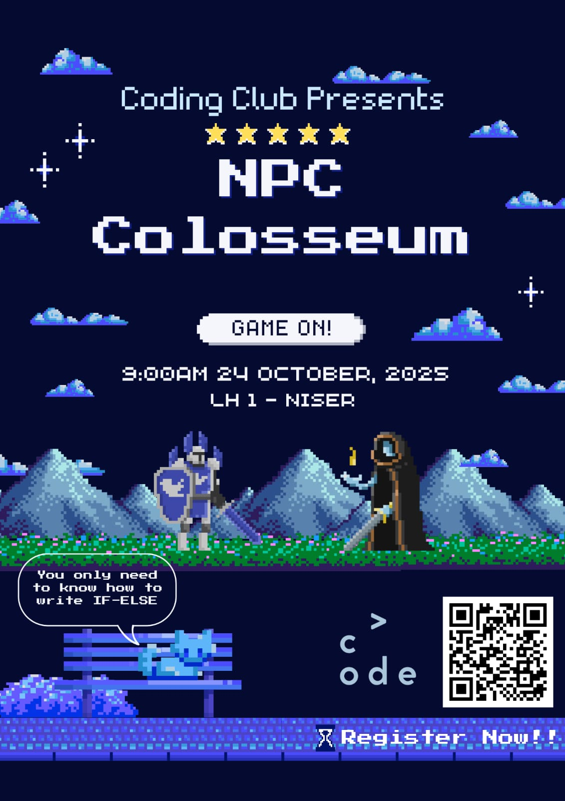

## NPC Colosseum

---

A small turn-based combat game made for the 2025 NISER college fest `Umang`.
Contestants have to code up bots that play the game. Their bots are pitted against each other to find the winner.

Install pygame and run `main.py' to start the game. The default bots are shown in `player1.py` and `player2.py`.
